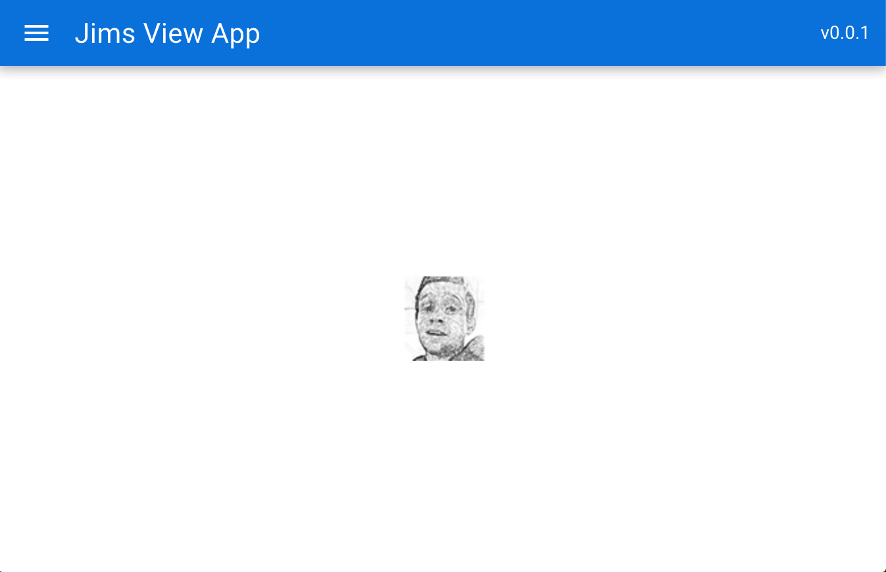
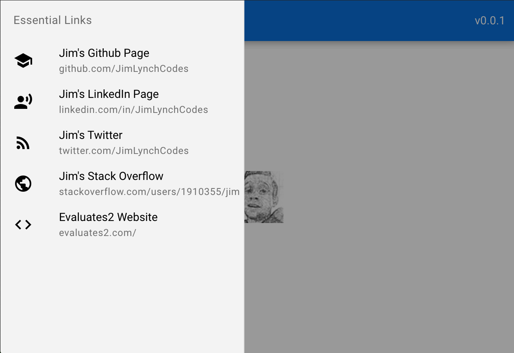

# Jims-Vue-Quasar-Test
Example of a [Vue.js](https://vuejs.org/) project created with the [Quasar Framework](https://quasar.dev/).

This project was created with the [quasar-cli](https://quasar.dev/quasar-cli):
```
npm i -g @quasar/cli
```

Then this command was run:
```
quasar create jims-vue-app
```
And these add-ons were chosen:
◉ ESLint
◉ Vuex
◉ Axios

Then just use the usual commands in `pacakge.json` to run the code!

Start dev server:
```
npm start
```
Then visit: http://localhost:8080

Run unit tests (with jest):
```
npm test
```

Build:
```
npm run build
```

---



<br/>
<br/>

